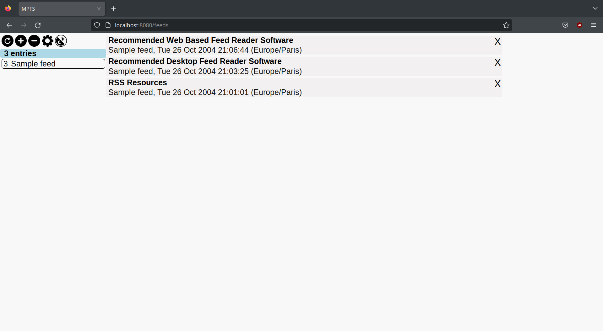
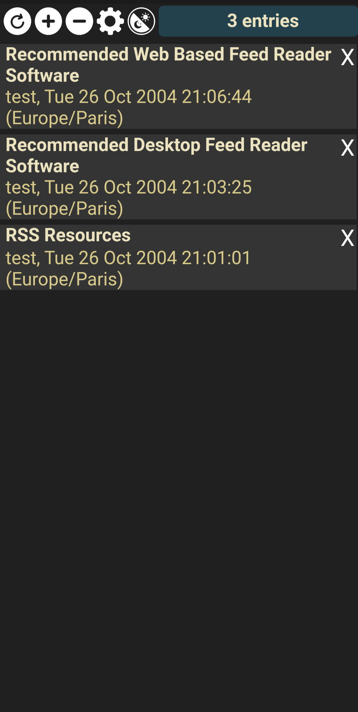

# MPFS
A personal server to read RSS feeds, with synchronization across devices and a responsive web UI that is adapted to desktop and mobile.

* This is a personal server: it only supports one user per instance.
* Atom, RSS1 and RSS2 feeds are supported.
* There's a dark mode.

# Getting started
## Setup
### Building the project
Running `build.sh` will compile the Haskell back-end and Elm front-end. The server will serve files in the `templates` and `static` directories.

Optionally, a Dockerfile is included, to build an image (after running build.sh).

### Running the server
The server requires the following environment variables set:
* `MPFS_USERID`
* `MPFS_SESSION_KEY`

These variables are used for authentication, respectively as username and password.

Optionally, the following variable can be set:
* `MPFS_DB_PATH`

The server saves its data in an SQLite database. If the variable isn't set, the server will create a new file in the project directory to store its data.
Otherwise, if this variable is set, the path stored in this variable will be used.

# Screenshots
Desktop, light theme:

Mobile, dark theme:

